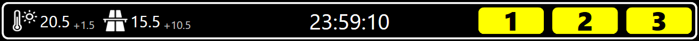
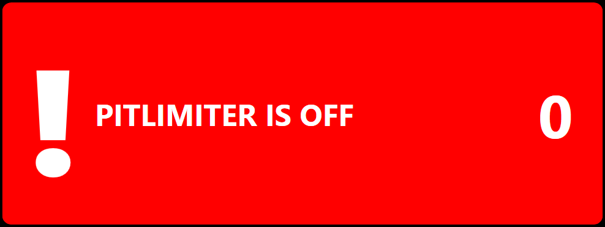

# Magic Dashboard

The Magic Dashboard was mainly built for Assetto Corsa Competizione but is also converted to iRacing. It can be used for any Sim that SimHub provides data for. Some feature might not work with other Sims than Assetto Corsa Competizione and iRacing.

> [!Warning]
>
> Since version v2.0 the minimum required version of SimHub is 9.1.0.

> [!Warning]
> Since version v1.9alpha the LPH Universal Plugin is needed to gain access to all features available.

## LPH Universal Plugin

The plugin provides more data which is mostly used for Assetto Corsa Competizione.

Available features:

* Average tyre pressures of the last lap
* Average tyre pressures of the last 3 laps
* Pressure loss calculated from the highest average lap pressure
* Pressure given in the MFD
* Temperature (air and track) difference since the last time in pits
* Time window for a lastest possible qualifying run
* Highest recorded session speed (of the driver)
* Highest recorded speed since the last time in pits (of the driver)

## Idle Screen

The Idle Screen shows the activated game, current installed dashboard version and if a new version is available a note will be displayed.

## Pages

## Lap Summary

When completing a lap the lap summary will be shown. Depending on the session type it shows either the gap to the car ahead/behind or the delta to the laptime of the car ahead/behind. The current driver position is shown as well as the overall fastest lap, the PB and the last laptime.

There are four different background colors for the lap summary:

1. **WHITE:** shown after outlap or when the laptime is marginally faster/slower than the PB
2. **GREEN:** shown when a new PB is set
3. **PURPLE:** shown when the last lap was the overall fastest laptime
4. **RED:** shown when the last lap was slower than the PB

## Fuel Alert

The fuel display has three different states which are active depending on the remaining fuel.
***next Stint*** is showing the amount of fuel needed to run to the end of the race. The first number being the amount of fuel which should be added at the next pitstop. The second number (the one in the brackets) shows the total amount of fuel which is needed to finish race. Both values are limited to the max amount of fuel the car can take.

### More than 5 laps of fuel remaining

### At least 3 laps of fuel remaining

### Less than 3 laps of fuel remaining

## Weather Conditions

### iRacing

Trackstates:

* **MHU:** Moderatly High Usage
* **LU:** Low Usage

### Assetto Corsa Competizione

Trackstates:

* **OPT:** 	Optimum
* **FST:** 	Fast
* **GRN:** 	Green
* **DMP:** 	Damp
* **WET:** 	Wet
* **FLD:** 	Flooded

## Top View

The Top View shows basic session info like temperature, time and position. For ACC it has also a penalty display which is visible when the driver got a penalty. For a few cars in iRacing the remaining overtake time is shown when overtake is enabled.

### Flags

The Top View contains a flag display showing the currently waived flag. Yellow flag for single sectors are currently only working in ACC.

Supported flags:

* **BLUE**
* **YELLOW** (overall and single sectors for ACC)
* **WHITE**
* **GREEN**
* **ORANGE**
* **CHECKERED**

### Version Warning

A new release of the Magic Dashboard might rely on new verions of SimHub. Therefore a warning will be displayed showing the minimum required version of SimHub.

## Center View

### Gearing and Pitlimiter

 	

### Battery Level

The battery level is an iRacing only feature and is only visible when driving a car with ERS. If the battery is below 30% the bar will change it's color to red.

### Engine Controls

### Discord

When installed the Discord plugin is able to show the voice state of the Discord client. There are four icons for mute, deaf, not in voice and offline.

## Pitlimiter Warning

If pitlimiter is turned of and the is currently in the pits the dashboard will show a warning.

## Alerts

The dashboard will show an alert if one of the following properties has changed: ABS, TC, TC2, Engine Map, ERS Mode, Track State and Weather.

